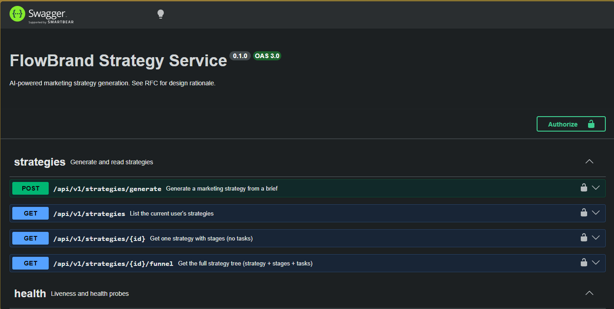
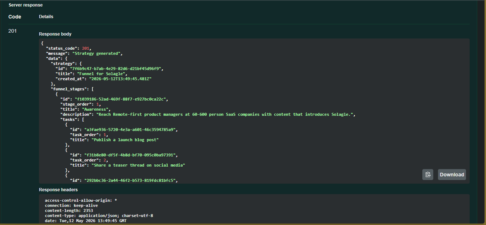
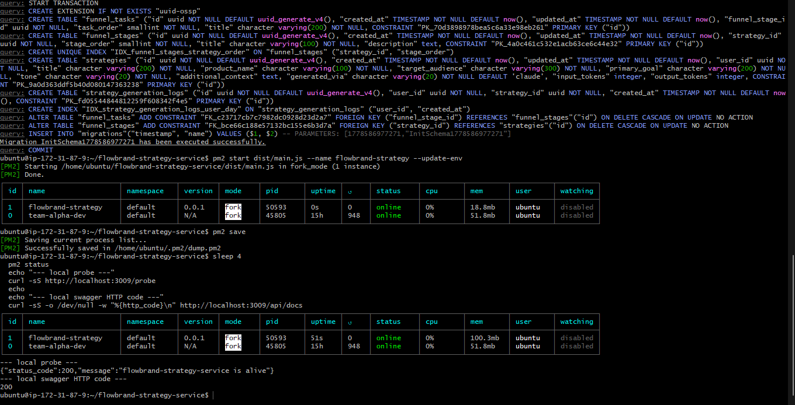
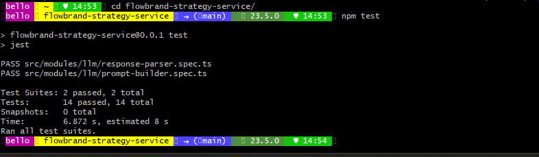

<div align="center">

# FlowBrand Strategy Service

**AI-powered marketing strategy generation for the FlowBrand platform.**

A focused microservice that takes a marketing brief and generates a complete strategy (funnel stages, tasks, and all) using Claude.


</div>

---

## What this service does

The FlowBrand product promises AI-generated marketing strategies. The main FlowBrand backend has the data model for it (`Strategy`, `FunnelStage`, `FunnelTask` tables), but no endpoint actually produces strategies. Users hit the brief form and there is nowhere to send the data.

This service fills that gap. You POST a marketing brief, it calls Claude with a structured prompt, parses the response, persists the full strategy tree (one strategy with multiple funnel stages, each with multiple tasks) in a single database transaction, and returns the tree as JSON.

Built as a standalone microservice so it does not touch the main FlowBrand backend. Drop-in addition rather than rewrite.

## Status

> ✅ **Submitted for HNG Stage 5 review (2026-05-12).** Live deployment, RFC, and System Design Document are all linked below.
>
> 🌐 **Live URL:** http://44.203.100.208:3009/api/docs (Swagger UI)

| Component | Status |
|---|---|
| Project scaffold | ✅ Done |
| RFC document | ✅ [Read it](https://docs.google.com/document/d/1r-pfXkgJSUw8WSe7rs-QcDf5bKXGsB4T0z8lXl7mynI/view) |
| Core endpoints (`POST /generate`, `GET /strategies`, `GET /strategies/:id`, `GET /strategies/:id/funnel`) | ✅ Done |
| LLM integration (Anthropic Claude + deterministic fallback) | ✅ Done |
| Database migrations | ✅ Done (1 migration, 4 tables, FK + unique index) |
| Unit tests (prompt builder + response parser) | ✅ 14 tests passing |
| JWT auth guard | ✅ Done |
| Per-user daily rate limit (5 successful generations / UTC day) | ✅ Done |
| Swagger UI | ✅ Done (`/api/docs`) |
| System design doc | ✅ [Read it](https://docs.google.com/document/d/1MtvkaVaLvZyPUVKu5uNLsmSMc7g9A5pvr8vnCU1IQOs/view) |
| AWS deployment | ✅ Live at http://44.203.100.208:3009 |
| Curveball decision log | ✅ Appended to the RFC |

This README updates as each piece lands.

## Tech stack

| Layer | Choice | Why |
|---|---|---|
| Runtime | Node.js 20 LTS | Long-term support, matches main FlowBrand |
| Framework | NestJS 11 | Mirrors the main FlowBrand backend so patterns are portable |
| Language | TypeScript 5 | Type safety end-to-end |
| Database | PostgreSQL 16 | Same as main FlowBrand; transactional writes for the strategy tree |
| ORM | TypeORM 0.3 | Migration-driven schema, matches main FlowBrand |
| LLM | Anthropic Claude (Sonnet 4) | Good cost/quality ratio, native JSON output mode |
| API docs | Swagger / OpenAPI | Auto-generated from controllers |
| Validation | class-validator | DTO-level enforcement |
| Tests | Jest | Unit + e2e |

## API (preview, locks in during RFC)

> 📖 **Live Swagger UI:** *deployment link will appear here once Phase 5 ships*

```
POST   /api/v1/strategies/generate     # brief → strategy tree
GET    /api/v1/strategies              # list strategies for the user
GET    /api/v1/strategies/:id          # one strategy with stages
GET    /api/v1/strategies/:id/funnel   # full tree: strategy + stages + tasks
```

All routes are JWT-guarded (header: `Authorization: Bearer <token>`).
Generation is rate-limited to **5 successful generations per user per day** to keep token costs predictable.

## Quick start (local dev)

### Prerequisites

- Node.js 20+
- Postgres 16 running locally (or via Docker)
- An Anthropic API key

### Steps

```bash
# 1. Clone
git clone https://github.com/ibraheembello/flowbrand-strategy-service.git
cd flowbrand-strategy-service

# 2. Install
npm install

# 3. Configure
cp .env.example .env
# Open .env and fill in DB_PASSWORD, ANTHROPIC_API_KEY, JWT_SECRET

# 4. Run migrations
npm run migration:run

# 5. Start the dev server
npm run start:dev

# 6. Open Swagger
# → http://localhost:3009/api/docs
```

## Project structure

```
src/
├── modules/
│   ├── strategies/          # POST /generate, GET, etc. Orchestrates the flow.
│   │   ├── dto/             # Request/response DTOs
│   │   ├── entities/        # Strategy, FunnelStage, FunnelTask
│   │   └── ...
│   ├── llm/                 # Anthropic SDK wrapper + prompt builder + parser
│   ├── auth/                # JWT guard (demo shim)
│   └── shared/              # Constants, helpers, custom exceptions
├── database/
│   ├── migrations/          # TypeORM migrations
│   └── data-source.ts       # ORM config
├── app.module.ts
└── main.ts
```

## Documentation

- **RFC:** [docs.google.com (RFC)](https://docs.google.com/document/d/1r-pfXkgJSUw8WSe7rs-QcDf5bKXGsB4T0z8lXl7mynI/view), the design proposal written before any feature code, including the Stage 5b change log.
- **System Design Document:** [docs.google.com (SDD)](https://docs.google.com/document/d/1MtvkaVaLvZyPUVKu5uNLsmSMc7g9A5pvr8vnCU1IQOs/view), architecture diagram, data model, request lifecycle, failure modes, scalability notes.
- **API Reference:** Swagger UI on the live deployment, see Deployment section below.

## Running tests

```bash
# Unit tests
npm test

# E2E tests
npm run test:e2e

# Coverage report
npm run test:cov
```

## Deployment

Currently deployed alongside the main FlowBrand backend on AWS EC2, sharing the Postgres instance with a dedicated `flowbrand_strategy` database. Runs under PM2 as `flowbrand-strategy` on port 3009.

> 🌐 **Live URLs**
>
> Swagger UI: http://44.203.100.208:3009/api/docs
> Health: http://44.203.100.208:3009/health
> Probe: http://44.203.100.208:3009/probe

Deployment is a direct `git clone` + `npm install` + `npm run build` + `pm2 start` on the EC2 (no tarball pipeline since this is a one-off service). Migrations run via `npx typeorm migration:run` against the compiled `dist/`.

## Live demo

### Swagger UI

All six endpoints documented and reachable on the public URL.



### Strategy generation in action

A successful `POST /strategies/generate` from Swagger UI. Response is HTTP 201 with the full strategy tree (one Strategy, four FunnelStages, three FunnelTasks per stage). The `generated_via` field marks the path taken (`claude` or `fallback`).



### PM2 process state on the EC2

The service runs alongside the main FlowBrand backend (`team-alpha-dev`) on the same instance. Migrations ran clean, probe returns 200, Swagger returns 200.



### Unit tests

14 unit tests across `prompt-builder.spec.ts` and `response-parser.spec.ts`. All passing in under 7 seconds.



## Why a separate repo

The Stage 5 task explicitly requires leaving existing functionality untouched. Building this in-place in the main FlowBrand backend would have meant either:

1. Adding migrations the rest of the team didn't agree to, or
2. Branching off and risking merge conflicts with active feature PRs.

A standalone microservice with a clean API contract sidesteps both. The main FlowBrand backend can call this service when it is ready, with interface-only coupling.

## Author

**Ibraheem Bello**, [github.com/ibraheembello](https://github.com/ibraheembello)

Built as a submission for the HNG internship Stage 5 backend task. Cooked under deadline pressure with a deliberate curveball (see RFC change log).

## License

MIT
